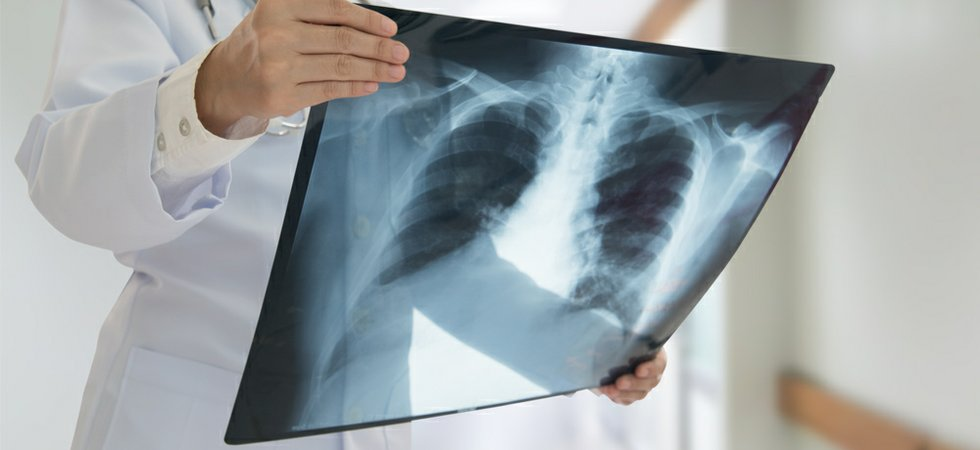
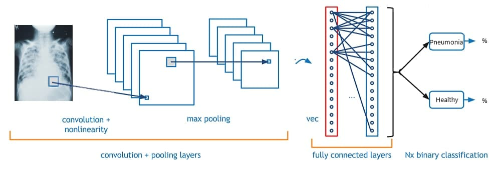

# Chest X-Ray Analysis and Classification of Presence of Pneumonia

<b>Authors: Marcos Panyagua, Christos Maglaras</b> <br>
Date: 04/02/2021

## Stakeholder


We focused on the social aspect of the application of this project and thought it would be valuable to developing nations that struggle with resources and qualified work force. Most of the time they have a lot of patients to take care of and a low number of personnel, that could lead to overworked professionals increasing the possibility of misdiagnosis and unnecessary treatment and tests. From a financial perspective it would mean a more cost-effective process, in comparison to a doctor a computer could easily be 100 times cheaper. That means more money to invest in other areas or it could also work as a tool for the radiologist/infectologist, being a first screening process.

## Data
' | '
- | -
 | 

Our dataset consists of 5856 total x-ray images, with a three to one class imbalance towards a positive result. The data is collected from the Guangzhou Women and Children’s Medical Center and sourced from Mendely Data. Visit the former here: http://en.gzfezx.net/ and the latter here: https://data.mendeley.com/datasets/rscbjbr9sj/2 . 

## Business Understanding

There are 120 million episodes of pneumonia per year in children under 5, over 10% of which (14 million) progress to severe cases. There was an estimated 880,000 deaths from pneumonia in children under the age of five in 2016. Most were less than 2 years of age. Pneumonia is the world’s leading cause of death among children under 5 years of age, accounting for 16% of all deaths of children under 5 years old, killing approximately 2,400 children a day in 2015 according to the American Thoracic Society. Also according to the society, Pneumonia is one of the top ten most expensive conditions seen during inpatient hospitalizations and in 2013, pneumonia had an aggregate cost of nearly 9.5 billion dollars. 

## Model


The model we have developed is a neural network tuned to image data. This is done by using Convolutional layers which are depicted in the image above. Through our iterations of improvements to the model we tuned to Activation functions, Optimizers, Resolution, image Augmentation, repeating blocks of layers and adding and removing new types of layers based on research and experimentation. 

## Takeaways

The model we have developed below can serve a highly practical service to hospitals, clinics, laboratories or any other organization that needs to have x-rays classified. Not only does the model preform well, we have also kept in mind the speed at which results are returned, as time is an important factor in medical settings. As a tool that serves radiologists, not replace them, a radiology department would be able to process many more patients at a cheaper cost. As a radiologist has two main tasks, to scan patients and to read and diagnose the scans after they are completed, lightening the load on the diagnostic side allows for much more time to be alloted for accepting new patients. This in turn lightens the load of the rest of the hospital both financially and by recources, which are the two most important factors for hospitals in developing countries.

## Contents
```
├── data
|   ├── images
|   |   ├── cell.jpg
|   |   ├── conv.mp4
|   |   ├── guangzhou.jpg
|   |   ├── imbalance.png
|   |   ├── mendel.jpg
|   |   ├── network.jpg
|   |   └── xray.jpg
|   └── dataset
|       ├── train
|       |   ├── NORMAL
|       |   └── PNEUMONIA
|       ├── val
|       |   ├── NORMAL
|       |   └── PNEUMONIA
|       └── test
|           ├── NORMAL
|           └── PNEUMONIA
├── notebooks
|   ├── christos.ipynb
|   ├── marcos_img_class.ipynb
|   └── image_class_notebook.ipynb
├── presentation.pdf
├── final_notebook.ipynb
└── README.md
```